- **前言**
1. 该教程仅支持发布于2021年5月以及之前的SOC（也就是天坤920之前的CPU）

2. 以红米note8Pro为例，其他mtk机型可以参考参考

3. 系统建议使用win10可避免一些问题

4. 如果您的系统已经扩容了或修改了分区表。请在最后一步刷机的时候把仅下载切换至固件升级即可正常刷机（红米Notre8Pro测试通过，不会掉IMEI和基带）

- **准备工作**
1. 一部已经黑砖不开机的手机

2. 一根数据线和一台正常的电脑（网吧不建议)

3. 一双手和一个正常的脑子

4. 一个良好的网络环境

- **需要的文件**
1. MTK驱动压缩包

2. VCOM驱动压缩包

3. libusb-win32安装程序

4. AuthBypassTool v11（MTK Client Tool也可以，仅支持win10）

5. flashtool,压缩包

6. MIUI完整线刷包（下载地址：XiaomiROM.com）
   
   

说明：以上资源均可在下载站找到并下载，路径：首页→通用手机刷机资源→电脑工具→联发科救黑砖全套

**教程开始**

1. 安装MTK驱动。把下载好的mtk驱动解压开来。会得到两个文件夹（如图）。选择第一个文件夹进去。之后选择win10
   
   
   
   
   
   
   
   

2. 双击打开MediaTek Devices Installer.bat（如图）

3. 来到这个界面。直接一路回车，直到窗口关闭就行（如图）
   
   

**安装vcom驱动**

1. 下载好vcom驱动压缩包解压开来。之后右击cdc-acm.inf这个文件。选择安装。等待弹出安装完成（如图）

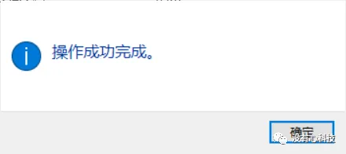

说明：如果是win11，点击安装后会没有反应，请无视即可

安装libusb-win32

1. 双击打开libusb-win32安装程序，一直下一步就可以了

2. 出现下图这个界面，就可以直接关掉了，不用管他

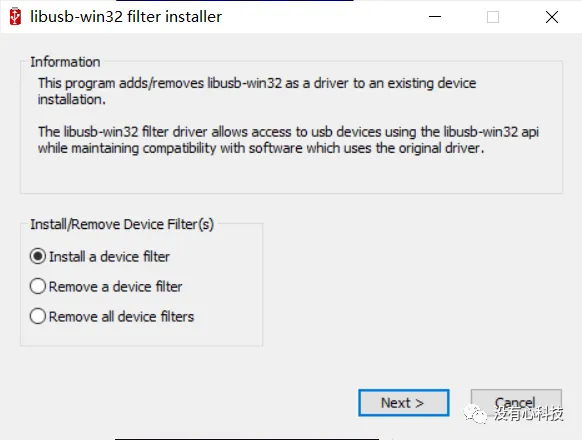

**进行联发科跳免授权**

1. 打开AuthBypassTool v11这个软件（如图）

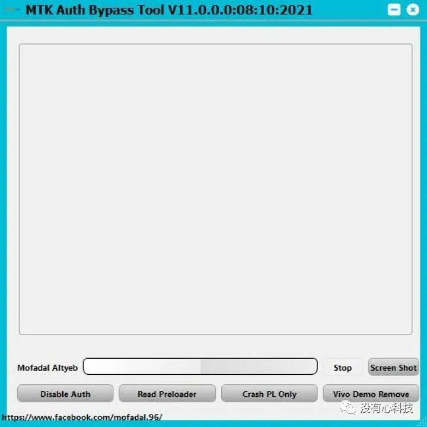

2. 点击左下角的disable auth。这时候会有一个进度条在走。也就是倒计时。走完了就得重新点一下。之后手机按住音量+和电源键连接上电脑。如果出现下图所示，则表示成功并松开。不能拔掉数据线（如图）

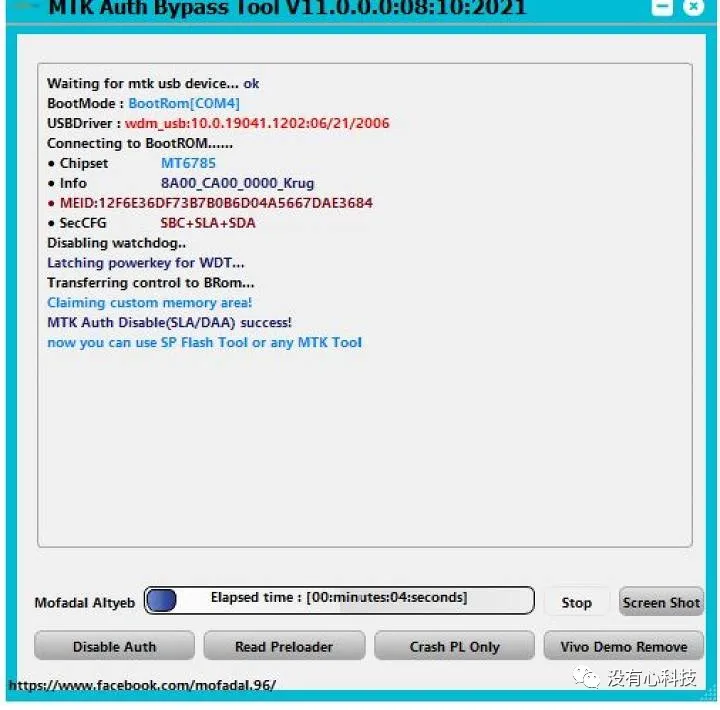

如果出现了下图显示（也就是报错）。可重新来一次。一般来讲就可以成功了

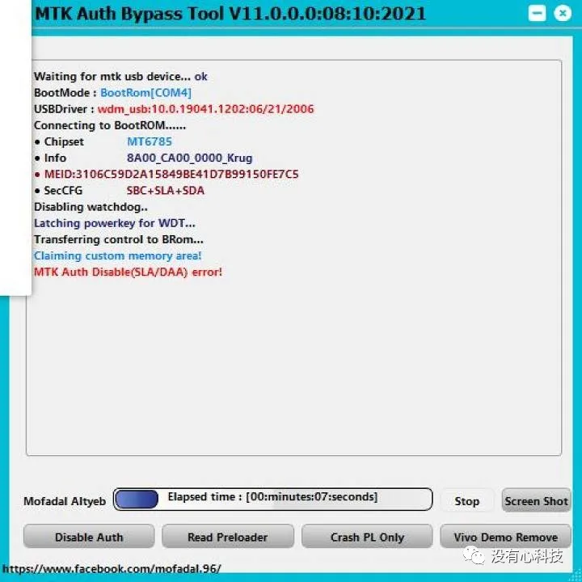

成功之后关闭该工具。进行下一步刷机

**最后的刷机**

1. 先把线刷包解压成一个文件夹（如果解好了，可以跳过）。把刚下载好的flashtool压缩包解压开来。得到很多文件。我们主要打开flash_tool.exe这个程序

2. 打开之后，有一个报错窗口（如下图）。不要管他，直接点确定

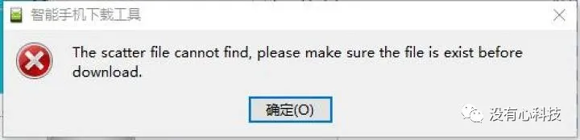

3. 来到主界面（如下图）。第一个下载DA。点击后面的浏览

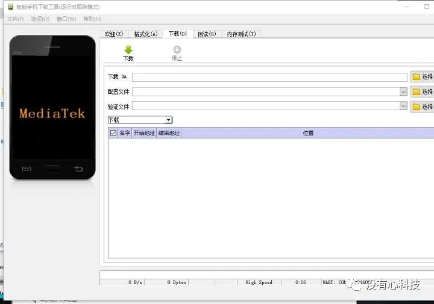

4. 选择倒数第二个（如下图）

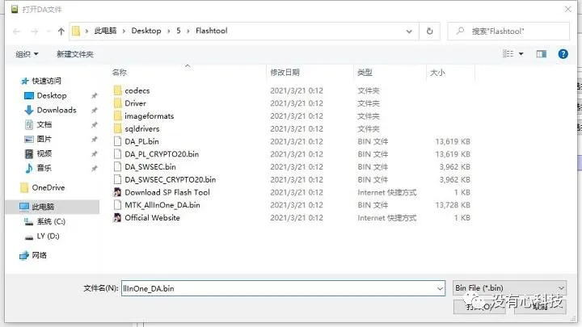

5. 选择完之后。来到第二个。选择线刷包位置。之后点第一个文件夹进去（如图）

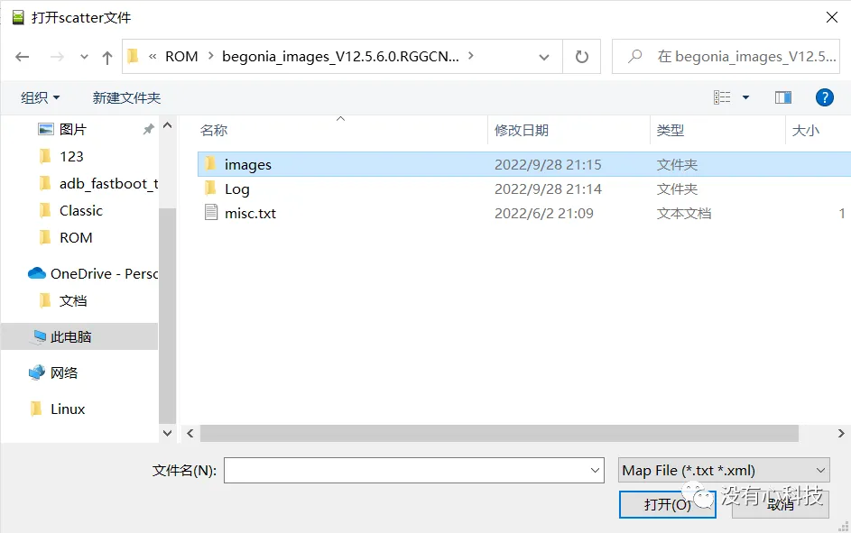

6. 选择倒数第二个的txt配置文件（如图）

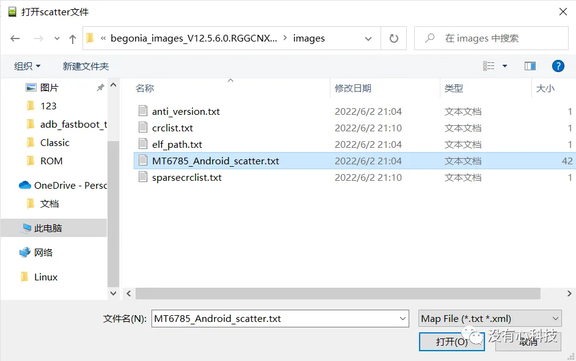

7. 之后点确定会开始加载镜像文件。等待加载完成（如图）

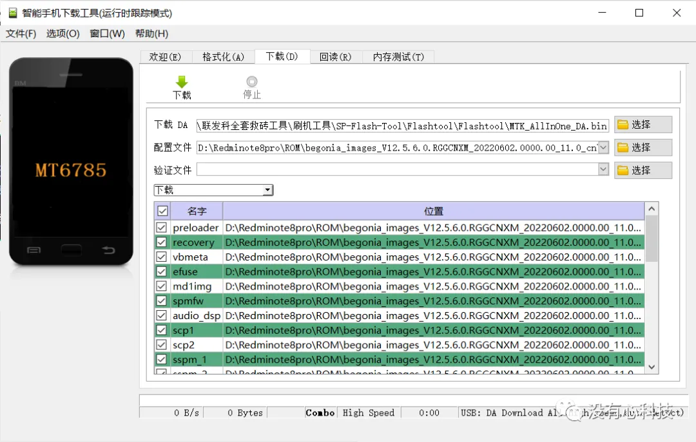

**检查端口**

先别着急点下载。先检查一下连接里面的端口是否和驱动用的端口一致。点左上角选项进去。切换到连接选项卡。看看后面的串口，看一下是不是和设备管理器里面的MTK端口一致。如果一致。就可以关掉窗口，点下载刷机了  
举个例子。如果设备管理器显示的端口是com4。那么连接这边后面的串口也得是com4。如果不一样。是可以改过来的。最后一样，就可以刷机了 （如图）

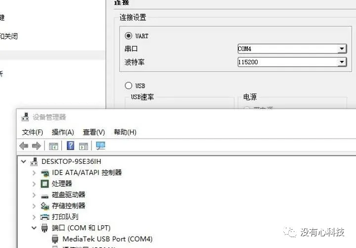

说明：如果UART没有正确显示MTK端口，但设备管理器已经显示了，请切换到USB通道再进行尝试刷机

**开始刷机**

1. 如果端口确定好没错的话。就可以开始刷机了。点主界面的下载。会开始跑进度条。等待下载完成（如图）
   
   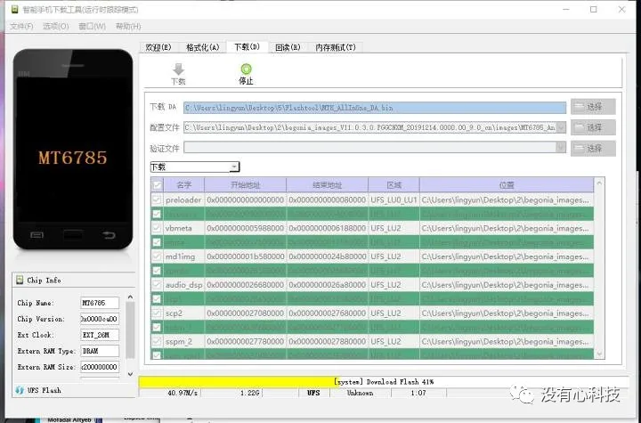
   
   

再次说明：如果您的系统已经扩容了或修改了分区表。请在这一步的时候把仅下载切换至固件升级即可正常刷机（红米Notre8Pro测试通过，不会掉IMEI和基带）

2. 刷机完成之后，会出现一个绿色的大√。则表示刷机成功。手机长按电源键十秒。一般来说，这时候手机已经救活了。如果跳到官方rec。请清除所有数据之后即可开机（如下图

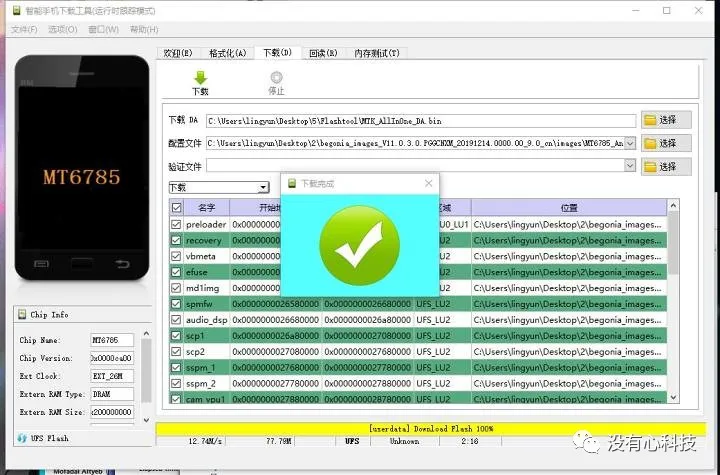

3. 致此手机已经完全救活过来了

说明：如果刷机过程中出现某个分区刷入报错，请在该分区名的前面取消勾选它，随后再次尝试刷机

**结束**

希望写了这么久的图文教程。能够帮助到大家。也希望小白们也不要去花钱刷机了。看到这篇教程自己学会了。也可以帮助到别人的。避免花冤枉钱。有什么问题请点击底部的发信息即可问我。如果你觉得还不错的话。可以赞赏我。自愿赞赏。不强迫。最后，祝大家刷机愉快
