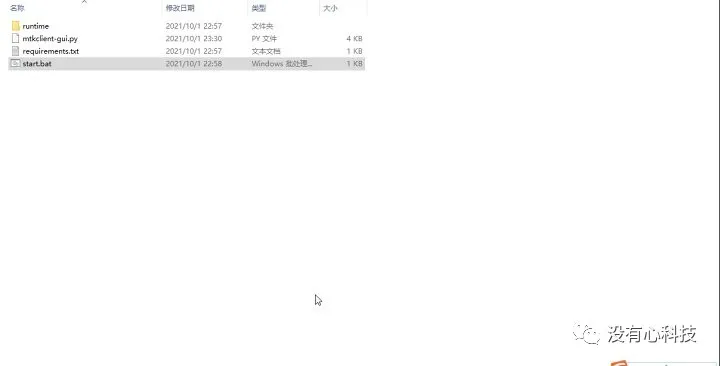
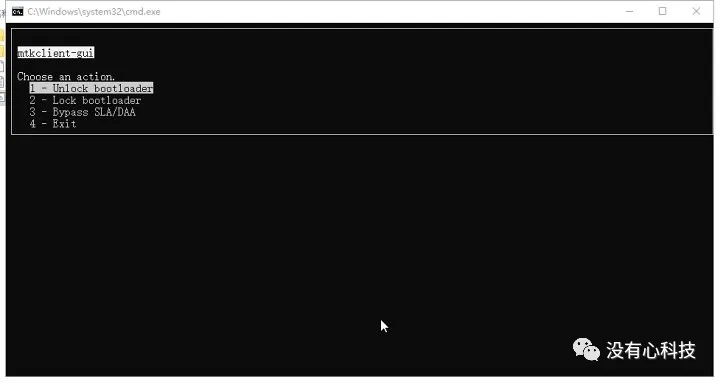
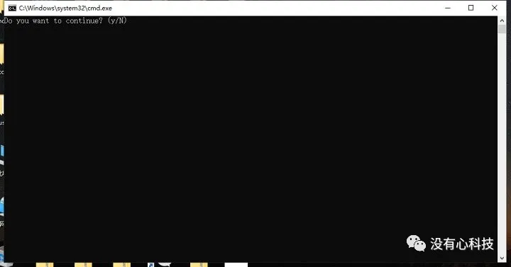
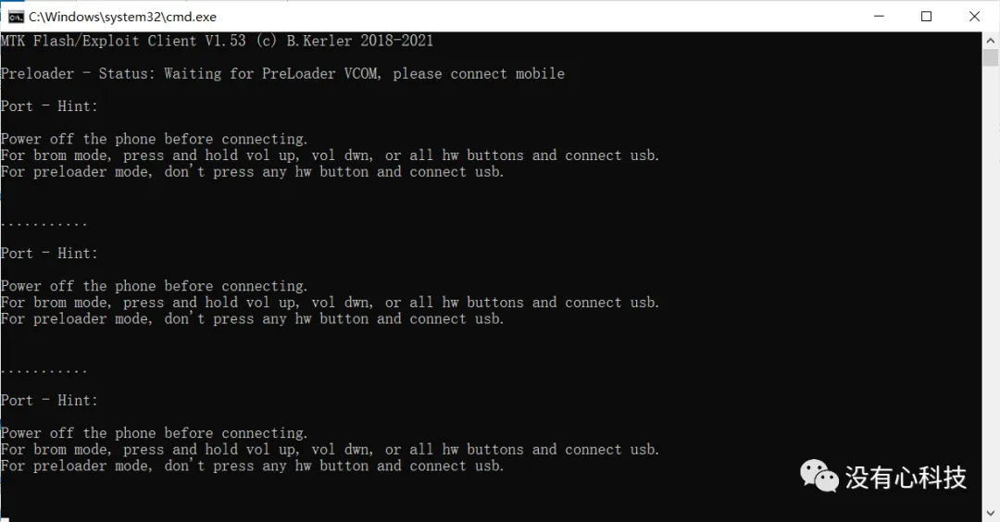
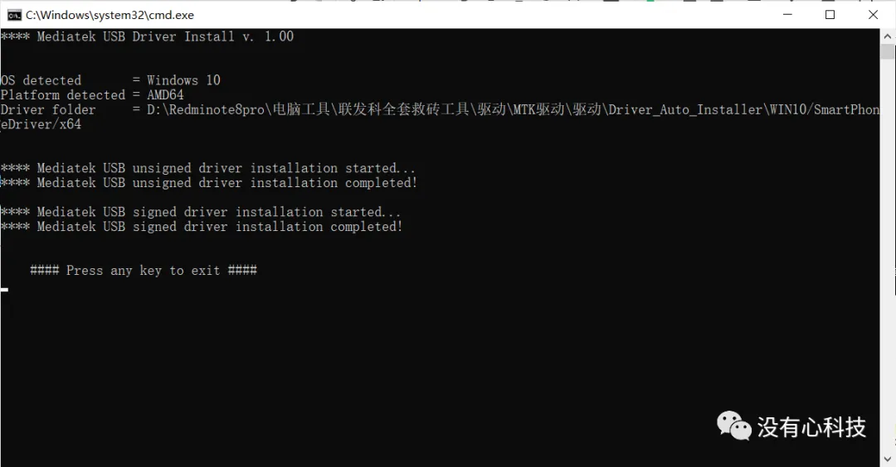
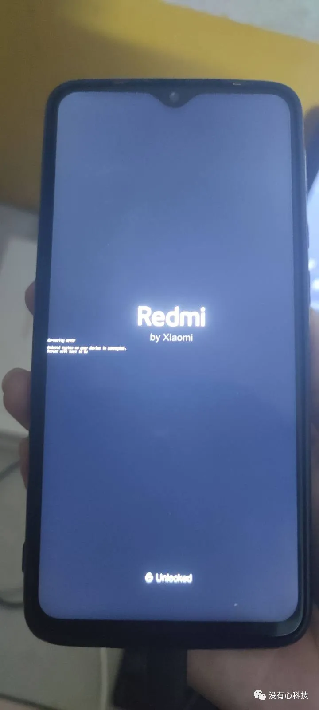

前言

该教程仅支持发布于2021年5月以及之前的SOC（也就是天坤920之前的CPU）

以红米note8Pro为例，其他mtk机型可以参考参考

系统建议使用win10可避免一些问题

**准备工作**

1. 一部未解除BL锁的手机

2. 一根数据线和一台正常的电脑（网吧不建议)

3. 一双手和一个正常的脑子

4. 一个良好的网络环境

**需要的文件**

1. mtkclientgui压缩包  

2. USB DK（一般用X64版本）

说明：以上资源均可在下载站找到并下载，路径：首页→通用手机刷机资源→电脑工具→联发科强解bl锁工具

**教程开始**

1. 首先下载这个工具和USBDK，下载完之后，把这个zip包解压下来，放桌面方便一些

2. 首先安装USBDK，双击msi程序会自动进行安装

3. 之后打开文件夹，找到最后一个Start.bat双击打开（如图）

5. 输入y确定下一步

6. 此时手机关机状态下按住音量+和电源键连接电脑，听到连接声音响了就立马松开，如果跟我一样，弹出以下界面，那么恭喜你。bl锁解开成功（如图）

7. 最后长按电源键10妙重启手机查看结果，红米note8pro已测试通过，其他联发科机型可以试试（如图）

说明：如果连接没反应，请手动安装MTK驱动

- **结束**

希望写了这么久的图文教程。能够帮助到大家。也希望小白们也不要去花钱刷机了。看到这篇教程自己学会了。也可以帮助到别人的。避免花冤枉钱。有什么问题请点击底部的发信息即可问我。如果你觉得还不错的话。可以赞赏我。自愿赞赏。不强迫。最后，祝大家刷机愉快
