前言  

经过漫长的时间等待，IMEI修复教程总算是来了（麻麻再也不用担心丢了IMEI而烦恼），不需要复杂的手段，就可以将你的手机修好IMEI，最后还是感谢这位老外Tim Josten。不墨迹，直接接下来的内容  

一. 准备工作  

1.一部丢了IMEI的n8p（解锁状态）  
2.电脑和数据线（尽量windows 10及以上）  
3.本文所提到的文件都需要  
4.第三方内核/ROM（kernel或ROM）  

二. 开始制作专属修复imei卡刷包

1.下载好这个压缩包。下载链接；[查看链接](https://wwjo.lanzouy.com/iRXqn0w65lhc "https://wwjo.lanzouy.com/iRXqn0w65lhc")  
2.解压后有以下文件（图1）

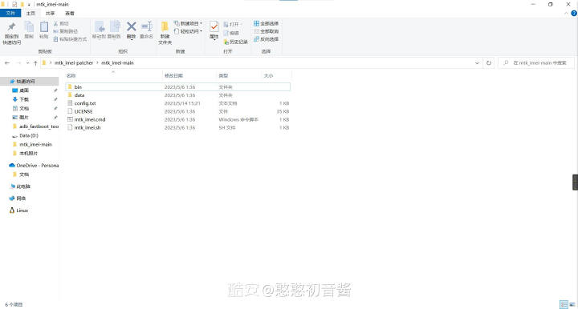

3.打开config.txt（如图2-3）

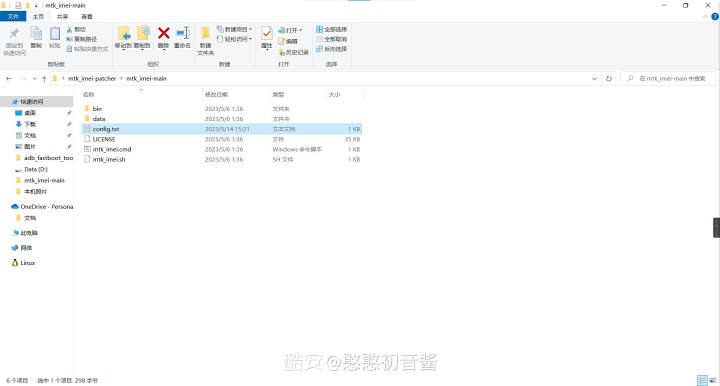

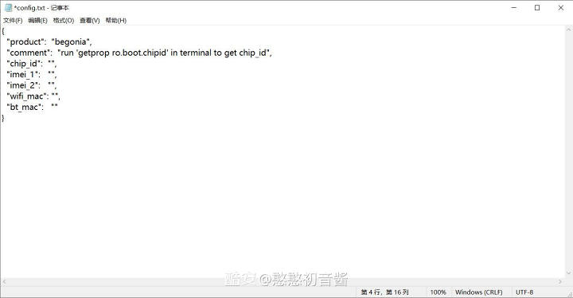

4.解释一下各参数的用途吧  
①cpidid=设备芯片的ID，每个手机的芯片ID都不一样，所以要如实填写（不要老想着用别人的，出问题了就不能怪自己）  
问；如何获取芯片ID？  
第一步，下载并打开termux（酷安或者百度都可以）  
第二步；输入getprop ro.boot.chipid回车  
第三步；出现图片中的结果就表示获取成功

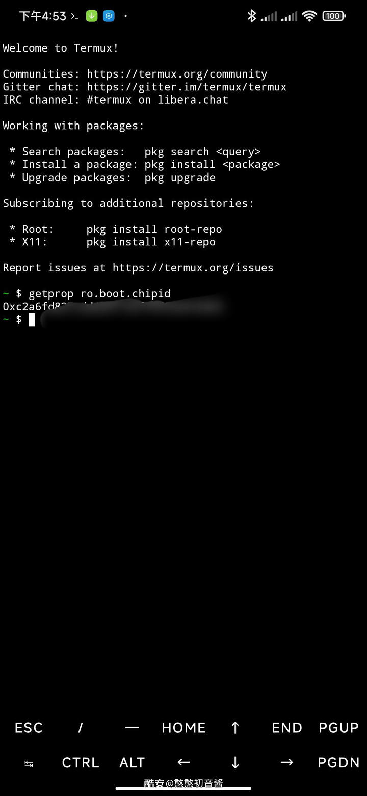

本次教程就到这里，该说的我已经说了，要是还不会的话，那我没办法（解锁和刷入第三方twrp应该都会了吧）
强制解锁教程可以参考我；查看链接
TWRP资源可以去我站点下载
如果有其他问题，请在评论区底下进行交流，不懂的我看到了一般会回复，教程结束

②第二和第三就不用说了，自己填（可以是自己的原机imei，也可以像我一样随便填MIUI系统  
第一步，打开设置→我的设备→全部参数  
第二步，找到状态信息→就可以查看这两个MAC地址的详细信息，也是把它复制出来，填到这个配置文件就可以  
操作流程如下（图）

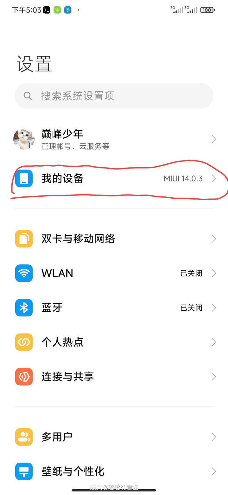

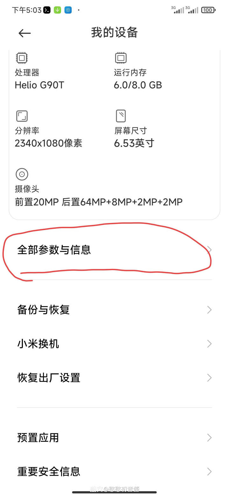

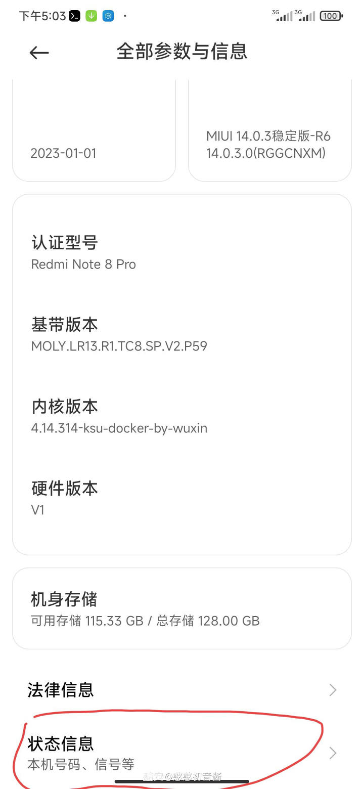

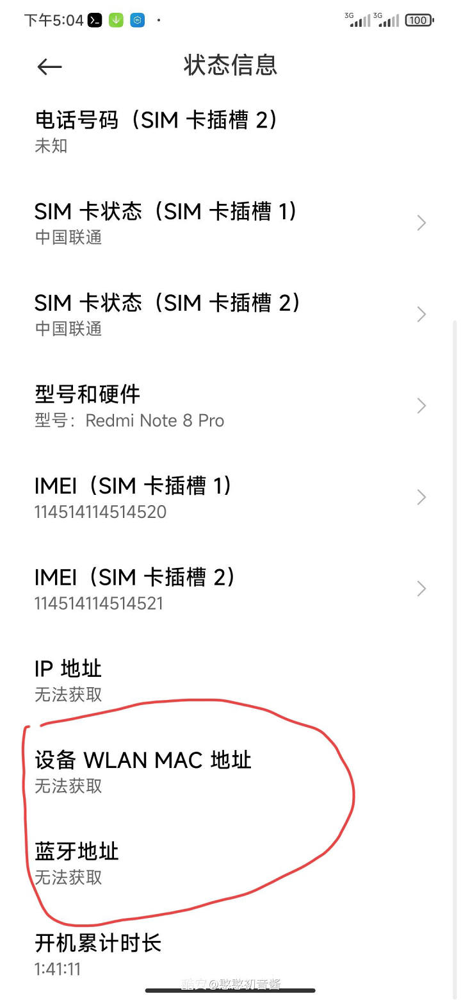

问；为什么会显示无法获取？  
就是因为没有打开WIFI和蓝牙功能，打开之后就可以正常获取了  
原生系统  
操作流程跟MIUI差不多，我这里就不发图片了  
5.配置文件全部填完之后保存  
6.直接双击打开mtk_imei.cmd，显示图片中的结果就是制作完成（图）

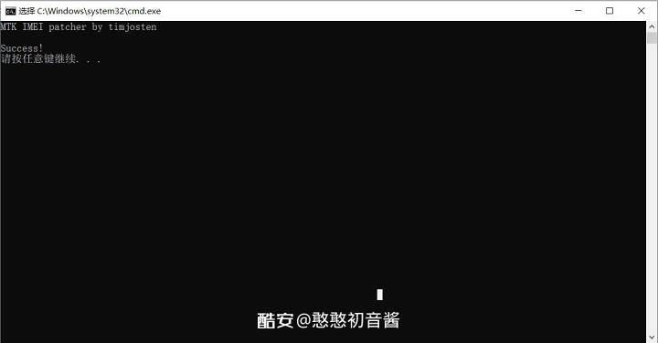

7.完成之后关闭窗口，你会得到一个修补好的卡刷包，使用twrp刷入即可

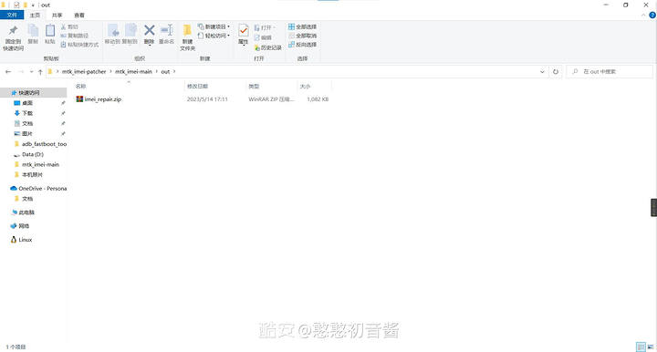

8.最后就会看到你修复好的IMEI

三. 其他重要说明  

1.本修复教程适用所有基于ROSS的ROM（包括MIUI12.5所有版本，基于这个底层的第三方ROM和类原生）  
2.不适用基于QOSS及以下的ROM（包括miui10.miui11.miui12和基于这个底层的第三方ROM以及类原生）  
3.不适用基于cfw底包的原生系统使用  
4.如果你的WINDOWS缺少Visual C++ Redistributable for Visual Studio 2015(x64)，请点击下方链接下载并安装（如果有了请忽略）  
下载链接；X64；[查看链接](https://wwjo.lanzouy.com/ilfES0w6apmb "https://wwjo.lanzouy.com/ilfES0w6apmb")  
X86；[查看链接](https://wwjo.lanzouy.com/i1wMD0w6aq4j "https://wwjo.lanzouy.com/i1wMD0w6aq4j")  
5.切换ROM时，请确保在刷入ROM后立即刷入“imei_repair.zip”文件，然后再进行第一次开机。这是必要的，因为删除系统分区将需要你再次刷入修复包  
6.官方内核可能会不工作，请使用第三方内核（我的内核已经集成了，到时候再编译一遍不带root的供你们使用）  
7.本教程仅适用Redmi Note 8 Pro，其他机型能不能用我不清楚（自己试试就可以了）  

要求就是内核版本必须是4.14的，而且集成了这个模块  
链接；[查看链接](https://github.com/AgentFabulous/begonia/commit/111f687d092b7fd1ccc64710795035ef30520629 "https://github.com/AgentFabulous/begonia/commit/111f687d092b7fd1ccc64710795035ef30520629")

四.目前状态  
小米账号与小米云服务已正常使用（包括查找手机），其他的就留给你们测试了

五.修复成功截图

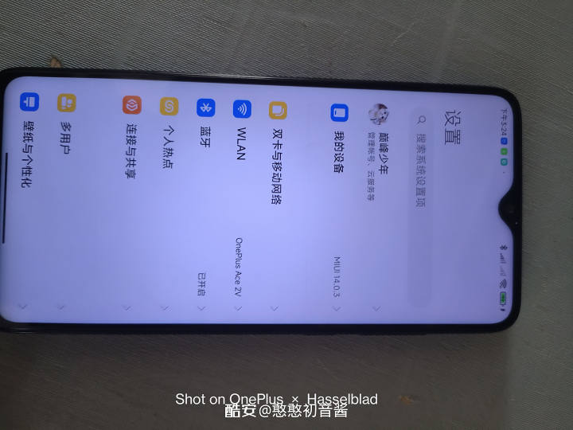

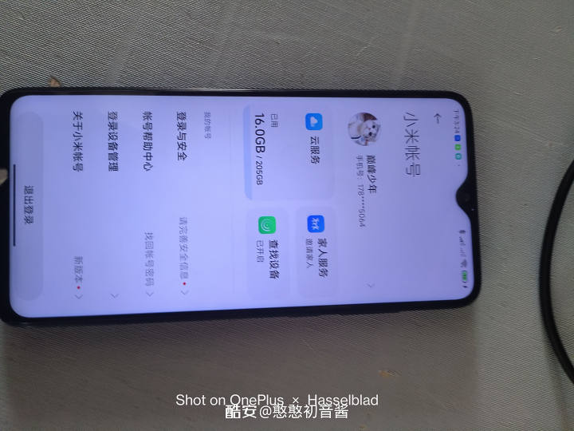

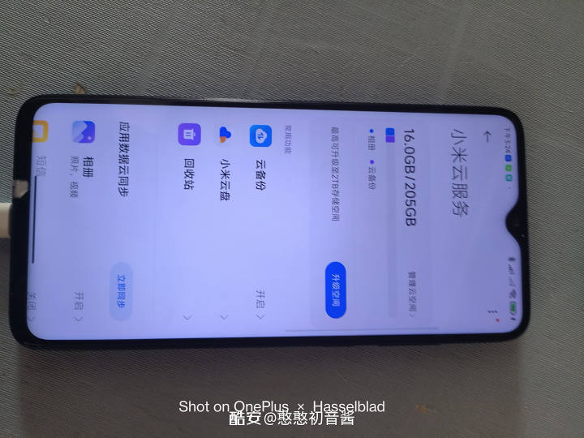

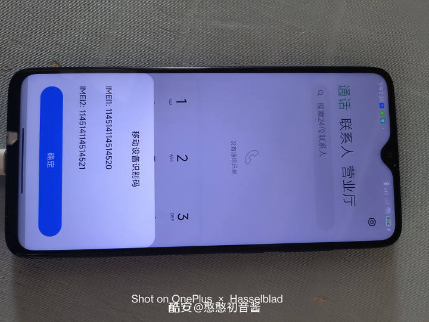

本次教程就到这里，该说的我已经说了，要是还不会的话，那我没办法（解锁和刷入第三方twrp应该都会了吧）  
强制解锁教程可以参考我；[查看链接](https://www.coolapk.com/feed/31977436?shareKey=MGRkOTUyMmQ5NmExNjQ2MGFkYjM~&shareUid=3430069&shareFrom=com.coolapk.market_13.1.3 "https://www.coolapk.com/feed/31977436?shareKey=MGRkOTUyMmQ5NmExNjQ2MGFkYjM~&shareUid=3430069&shareFrom=com.coolapk.market_13.1.3")  
TWRP资源可以去我站点下载  
如果有其他问题，请在评论区底下进行交流，不懂的我看到了一般会回复，教程结束
